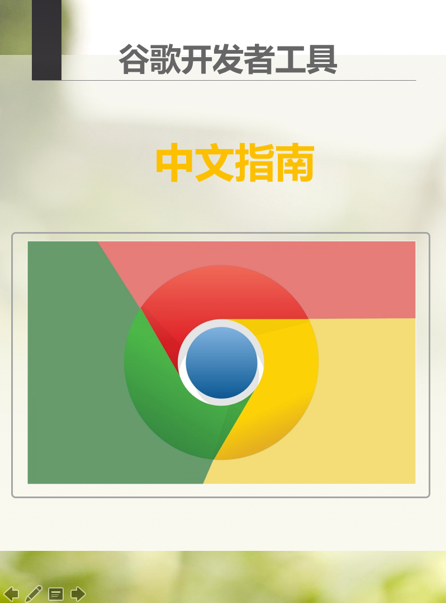

自 Google 发布 Chrome 浏览器以来，其附带的 Chrome 开发者工具就深受开发者们的喜爱，现在人们不仅仅用它来调试Web前端页面，还将它扩展用来调试移动应用和服务端应用

# Chrome 开发工具中文指南

谷歌 Chrome 开发工具，是基于谷歌浏览器内含的一套网页制作和调试工具。开发者工具允许网页开发者深入浏览器和网页应用程序的内部。该工具可以有效地追踪布局问题，设置 JavaScript 断点并可深入理解代码的最优化策略等等

而本指南是作者根据官方文档结合实际实践经验翻译而来，内容为翻译时的最新版本。

# 适用人群

这篇教程将会带你从头开始使用学习如何利用 Google 提供的开发者工具进行 Chrome 上的相关开发调试工作. 通过本教程，你将学会如何使用这些工具，并且学会如何通过它来定位和解决在前端开发工作中遇到到问题。通过对谷歌开发者工具的学习，也能掌握一些调试技巧，极大的提高我们分析问题、定位问题、解决问题的效率。

